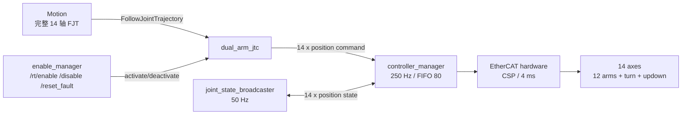
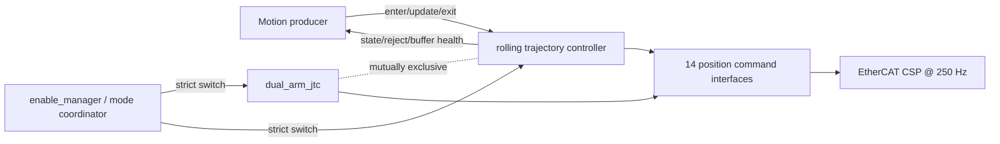
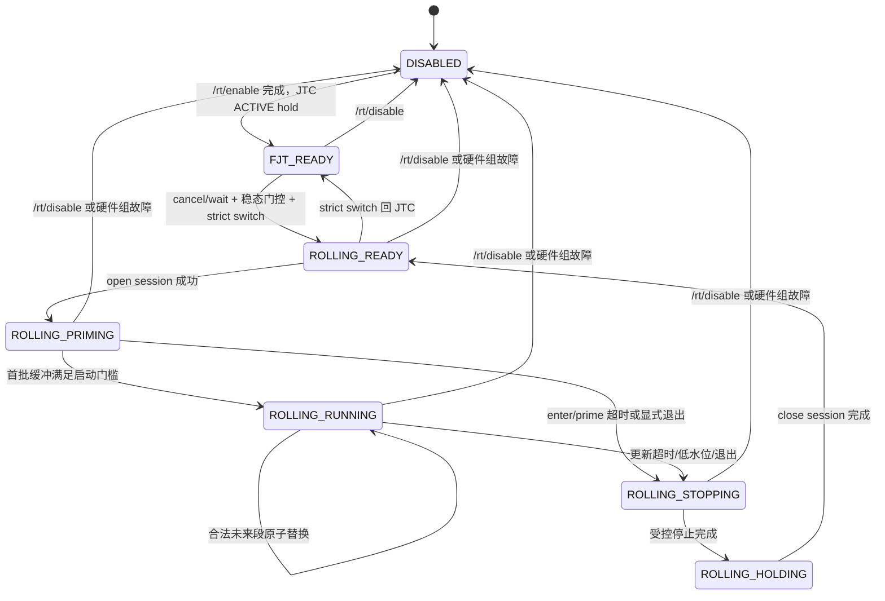

# ELECTRI-102 背景与设计交接：运控滚动目标队列实时更新与连续执行

> 本文用于 rt-control 与 Motion 联合设计，以及交给 Claude 继续评审。它不是已经冻结的接口规范，也不授权直接上实机运动。

| 项目 | 内容 |
|---|---|
| Linear | [ELECTRI-102：支持运控滚动目标队列实时更新与连续执行](https://linear.app/sevenova/issue/ELECTRI-102/rt-control-支持运控滚动目标队列实时更新与连续执行) |
| 上游联调项 | MOTION-124（被 ELECTRI-102 阻塞） |
| 文档状态 | `DESIGN HANDOFF / DRAFT` |
| 编写日期 | 2026-08-18 |
| 仓库基线 | `feature/rt-control-native-development`，HEAD `c4e8f90bea47a15890da45da653b109f875beedf` |
| 目标读者 | rt-control、电气、Motion、控制算法、安全/测试人员、Claude |
| 本文范围 | 背景、现状、候选架构、接口语义草案、待决问题、任务拆解和验证门槛 |
| 当前执行计划 | [electri-102-implementation-plan.md](electri-102-implementation-plan.md)（双轮只读评审后，等待 Gate 0 批准） |

本文保留广度背景和原始候选比较；具体实施顺序、source-quiescent mode switch、保守 stopping-viability 上界及最新任务编号以当前执行计划为准。两者若仍有冲突，应先修文档，不在代码中自行选择。

## 1. 阅读约定与权威顺序

本文使用以下标签，避免把事实、工单要求和设计建议混在一起：

- **[FACT]**：从当前仓库、已冻结裁决或工单中可以直接核对的事实。
- **[REQ-102]**：ELECTRI-102 明确要求保留的运行语义。
- **[PROPOSAL]**：建议的设计方向，尚未成为正式合同。
- **[DECISION NEEDED]**：rt-control、Motion 或安全责任人必须共同确认的选择。
- **[TBD-EVIDENCE]**：不能凭经验填写，必须由测量、供应商资料或受控试验得到的数值。
- **[NON-GOAL]**：本工单明确不负责的能力。

发生冲突时按以下顺序处理：

1. ELECTRI-102 保留的运行语义；
2. [rt-control 域规则](../AGENTS.md)和[既有冻结裁决](../BLOCKED-questions.md)；
3. 当前代码、配置及实机证据；
4. 经四域联合评审后冻结的跨域接口；
5. 本文中的候选设计。

当前工作区的 [跨域接口文档](../../../docs/cross-domain-interfaces.md)存在尚未提交的用户修改。本文只记录其中与本需求有关的目标状态，不修改该文件，也不把未提交内容冒充成已发布合同。

## 2. 先给结论

### 2.1 隐含但最关键的问题

ELECTRI-102 真正要解决的不是“能不能高频发轨迹点”，而是：

> **如何在不破坏现有完整 14 轴 FJT、控制器生命周期和硬件故障语义的前提下，让 rt-control 独占一个实时会话，确定性地接收和覆盖尚未执行的未来目标，并且在更新消失时仍有足够的剩余轨迹完成有界停车？**

这里的因果链是：

1. 只有“最新点”而没有未来缓冲，通信抖动会直接暴露为运动抖动或停顿；
2. 只有未来缓冲而没有更新时间上限，rt-control 可能继续执行已经失去上层确认的旧未来；
3. 只有超时而没有停车所需的动态边界，超时时刻可能已经没有足够轨迹余量完成连续减速；
4. 只有轨迹替换而没有不可修改边界和连续性校验，新旧轨迹拼接可能跳位或跳速；
5. 只有数据通道而没有会话、序号和状态，上层无法区分迟到数据、旧进程数据、拒绝和真正执行进度。

所以本需求必须同时设计：**会话、逻辑时间轴、固定容量缓冲、未来段替换、连续性、输入新鲜度、有界停车、控制器互斥和可观测状态**。单独提高 `/joint_states` 频率或降低某个老化阈值都不能完成 ELECTRI-102。

### 2.2 推荐的总体方向

**[PROPOSAL]** 将 ELECTRI-102 建成一个与现有 FJT 并列、互斥的 `ROLLING_REALTIME` 控制模式：

- Motion 发送完整 14 轴、带逻辑时间的短未来关节目标队列；
- rt-control 在同一个 `controller_manager` 进程内维护固定上限缓冲，并在本地 250 Hz 更新周期采样、插值、校验和输出位置命令；
- 现有 `dual_arm_jtc` 继续负责普通的有限时长 FJT，不改变其对外语义；
- 滚动模式与 JTC 不能同时占用 14 个位置命令接口，进入和退出通过严格控制器切换完成；
- 输入超时/队列不足处理属于滚动控制器内部，不建立独立 `rt_watchdog` 包，也不恢复 motion/autonomy 全局心跳；
- `/rt/disable`、EtherCAT/CiA402 Fault、硬急停/STO 等现有路径始终高于滚动会话。

这只是当前最清晰的候选架构。是否采用新控制器插件，必须先关闭本文 D-001、D-008 等设计决策；不应直接编码。

### 2.3 与视觉伺服的边界

**[FACT/REQ-102]** ELECTRI-102 的跨域输入是关节时序目标，不是机械臂笛卡尔 `TwistStamped`：

```text
视觉误差 -> 笛卡尔 Twist -> IK/Jacobian/碰撞与突变检查 -> 14 轴短未来目标
                       Motion 域                         |  rt-control 域
                                                       v
                                      滚动缓冲 -> 250 Hz 插值/限制 -> CSP 位置命令
```

- `TwistStamped` 可以是 Motion 内部视觉伺服命令形式；
- IK、碰撞检测、奇异性、关节突变检查和 6D Pose 逻辑仍由 Motion 负责；
- rt-control 不应从笛卡尔 Twist 自行求关节速度；
- 现有 `/cmd_vel_safe` 也是底盘命令，不能复用为机械臂视觉伺服接口。

因此，视觉伺服可以成为 ELECTRI-102 的一个生产者场景，但 ELECTRI-102 不能被缩减为“持续发送单个点”或“驱动层直接接收 Twist”。

## 3. ELECTRI-102 要求的可验证解释

| 工单要求 | 对设计的直接含义 | 最低验证证据 |
|---|---|---|
| rt-control 持有唯一实时会话和执行缓冲 | 同时最多一个有效 session；旧进程/旧 session 数据不能生效 | 双客户端争用、生产者重启、旧包迟到测试 |
| 运动中持续滚动更新短未来队列 | 更新不等待上一批执行完；新批次可在 `RUNNING` 状态接收 | 连续更新长稳测试，命令无周期性停顿 |
| 250 Hz 或更高采样、插值、限速和驱动 | 网络回调不进入硬实时链；实际输出只在本地控制周期产生 | 周期抖动、deadline miss、无 RT 动态分配证据 |
| 新数据覆盖未执行的未来段 | 必须定义不可修改边界、替换起点和新旧拼接规则 | 重叠、缩短、延长、交界时刻属性测试 |
| 过期、乱序、历史点不追赶 | 迟到更新不得把执行游标倒退，也不得瞬间补跑历史点 | 迟到/乱序/重复/序号缺口故障注入 |
| 从当前期望状态连续接续 | 拼接至少保证位置连续，并明确速度连续级别 | 拼接前后 `q`、`qdot` 离线及 250 Hz 采样断言 |
| 队列耗尽、断连、更新超时后有界安全降级 | 必须同时有输入新鲜度和可停车的缓冲余量；禁止无限外推 | 断更、队列耗尽和不同速度下的停车上界测试 |
| 状态足以让 Motion 判断执行情况 | 状态必须含 mode/session/进度/缓冲/更新时间/拒绝原因 | 状态机与实际缓冲的逐场景一致性测试 |
| 进入、更新、退出、恢复 | 不是单个 topic；必须有清晰的会话生命周期 | 正常退出、中途退出、超时后重入、进程重启测试 |
| 给 Motion 最小合同和 Mock | 接口 schema、QoS、状态、错误码和样例必须可独立实现 | 在不链接控制器内部库时运行 Mock producer |

## 4. 范围和非目标

### 4.1 rt-control 负责

- 唯一滚动控制会话及控制模式互斥；
- 固定容量、实时安全的接收/执行缓冲；
- 服务器侧逻辑时间、执行游标和已提交未来边界；
- 批次结构、序号、时序、容量、数值和控制边界校验；
- 新旧未来段替换和拼接连续性校验；
- 250 Hz 插值、最终命令约束和 14 轴位置接口输出；
- 更新老化、低水位、队列耗尽及有界停止；
- 状态、拒绝原因、诊断和审计计数；
- Mock、自动化测试、台架/实机验证说明。

### 4.2 Motion 负责

- 视觉/规划目标生成、IK、Jacobian 和奇异性处理；
- 碰撞、自碰撞、环境约束和关节突变检查；
- 完整 14 轴未来目标的时间参数化；
- 在 rt-control 公布的可替换时间之后持续生产足够长的未来段；
- 处理拒绝、低水位、超时和 session 终止，不重放旧批次；
- 不向 rt-control 发送 6D Pose 或机械臂笛卡尔 Twist 作为本接口的最终目标。

### 4.3 明确非目标

- **[NON-GOAL]** 不在本工单实现视觉检测或图像误差计算；
- **[NON-GOAL]** 不在 rt-control 实现 IK、碰撞检测或轨迹规划；
- **[NON-GOAL]** 不把软件 watchdog 宣称为安全等级急停；
- **[NON-GOAL]** 不用 ELECTRI-102 重做现有 FJT 行为；
- **[NON-GOAL]** 不新增独立 `rt_watchdog` 包或 motion/autonomy 心跳；
- **[NON-GOAL]** 不在没有实测/供应商证据时编造频率、队列长度、加速度、减速度或超时值。

## 5. 当前系统基线

### 5.1 运行路径



### 5.2 已确认事实

| 项目 | 当前事实 | 证据 |
|---|---|---|
| 控制周期 | `controller_manager.update_rate=250`，线程优先级 80 | [controllers.yaml](../../../src/rt_control/rt_control_bringup/config/controllers.yaml) |
| EtherCAT 周期 | `control_frequency=250`，各轴 CSP `mode_of_operation=8` | [ecat.ros2_control.xacro](../../../src/rt_control/robot_hw_ethercat/urdf/ecat.ros2_control.xacro) |
| 轴集合 | 固定顺序 `right_joint1..6,left_joint1..6,turn,updown`，共 14 轴 | [controllers.yaml](../../../src/rt_control/rt_control_bringup/config/controllers.yaml)、[BQ-118](../BLOCKED-questions.md) |
| 命令接口 | JTC 只声明 `position` command；状态只声明 `position` | [controllers.yaml](../../../src/rt_control/rt_control_bringup/config/controllers.yaml) |
| 普通轨迹 | `dual_arm_jtc`，禁止 partial goal，`open_loop_control=false` | [controllers.yaml](../../../src/rt_control/rt_control_bringup/config/controllers.yaml) |
| 上电生命周期 | JTC 初始为 INACTIVE；全组使能后才激活；失能会终止旧 FJT | [rt_control.launch.py](../../../src/rt_control/rt_control_bringup/launch/rt_control.launch.py)、[BQ-044](../BLOCKED-questions.md) |
| FJT 准入补丁 | 新 FJT 首点检查 14 轴位置和 EtherCAT 反馈年龄；逻辑只接入 Action goal callback | [JTC 补丁](../../../patches/ros2_controllers/0001-jtc-start-consistency.patch) |
| JTC 版本 | ros2_controllers 固定在 `cbcf66218ff43353f9fb5fe7a2c33f458d578d73` | [deps.repos](../../../deps.repos) |
| `/joint_states` | 当前运行配置与冻结生产合同均为 50 Hz；Controller Manager 保持 250 Hz | [controllers.yaml](../../../src/rt_control/rt_control_bringup/config/controllers.yaml)、[BQ-068](../BLOCKED-questions.md) |
| 跨域目标草案 | T1-04 已把未提交草案中的 `/joint_states` 100 Hz 冲突增量纠正为 BQ-068 的 50 Hz，最大年龄仍为 200 ms；ELECTRI-102 不据此调频 | [cross-domain-interfaces.md](../../../docs/cross-domain-interfaces.md)、[BQ-068](../BLOCKED-questions.md) |
| 当前本地 FJT 名称 | `/dual_arm_jtc/follow_joint_trajectory` | [controllers.yaml](../../../src/rt_control/rt_control_bringup/config/controllers.yaml)、[BQ-118](../BLOCKED-questions.md) |
| 接口包 | Phase 1 基线只有 `PlcIoState.msg` 与 `RtEnable.srv`；T1-02/T1-03 已新增 rolling V1 的三条消息和三条服务 | [robot_interfaces](../../../src/interfaces/robot_interfaces) |
| 独立 watchdog | 已冻结删除，不得恢复原 motion/autonomy 心跳 | [BQ-006](../BLOCKED-questions.md) |

### 5.3 单位和轴语义

| 轴 | 目标/状态单位 | 导数单位 |
|---|---|---|
| `right_joint1..6` | rad | rad/s、rad/s² |
| `left_joint1..6` | rad | rad/s、rad/s² |
| `turn` | rad | rad/s、rad/s² |
| `updown` | m | m/s、m/s² |

滚动接口必须使用与 ROS 关节语义一致的 SI 单位，不能发送编码器 raw count。所有点必须按冻结的 14 轴顺序解释，除非联合评审明确选择每批重复 `joint_names` 并逐次验证。

### 5.4 当前动态限制仍有冲突

**[FACT]** [joint_limits.yaml](../../../src/rt_control/rt_control_bringup/config/joint_limits.yaml)中的旋转轴速度/加速度来自 PLC XML，元数据明确标记仍需低速验证；[robot.urdf.xacro](../../../src/description/robot_description/urdf/robot.urdf.xacro)对机械臂关节又给出了 1.2/1.5 rad/s 等不同速度限制。Updown 已有 0.3 m/s 和 0.5 m/s² 的冻结记录，但不能据此推导所有旋转轴的停车能力。

因此：

- **[TBD-EVIDENCE]** 14 轴统一的位置、速度、加速度、受控减速度和允许跟踪误差来源尚未冻结；
- 在该问题关闭前，可以完成接口和离线算法设计，但不能宣称“断更后受控减速”已经具备生产安全依据；
- 不允许直接把 PLC XML 的 87.26 rad/s 数字当作滚动控制生产上限；
- 不允许用 JTC 的 `goal_time`、`stopped_velocity_tolerance` 或 FJT 首点 1°/0.05 m 容差替代连续拼接容差。

## 6. 为什么现有机制不等于 ELECTRI-102

| 机制 | 已具备能力 | 缺少的 102 语义 | 判断 |
|---|---|---|---|
| FJT Action | 完整轨迹、取消、结果、标准 JTC 插值 | 唯一 session、显式未来替换边界、序号、缓冲健康、更新 watchdog | 保留给普通规划轨迹，不直接承载滚动模式 |
| JTC `<controller>/joint_trajectory` topic | 运行中接收新 `JointTrajectory`，上游实现会替换旧消息 | 无独立 session/ack/seq；当前首点准入补丁不覆盖 topic；无 102 状态和安全降级合同 | 可用于原型，不足以直接验收 102 |
| MoveIt Servo 单点/短点输出 | 能周期性产生短时 JointTrajectory，适合低延迟伺服 | 不是带显式 committed boundary 的未来缓冲协议；队列耗尽和跨进程恢复语义不足 | 可作为 Motion 生产器参考，不是 rt-control 完整方案 |
| Forward position controller | 最新位置值链路简单 | 没有时间轴、插值、未来缓冲、连续停车和执行进度 | 不满足 102 |
| 非 RT wrapper 再喂 JTC | 容易快速验证消息 | 缓冲/安全状态与真正 250 Hz 执行器分离，无法严格证明原子替换和停车边界 | 不作为生产架构 |

现有 JTC 的 `open_loop_control=false` 只说明新轨迹初始化可读取实际状态，并不自动保证每次滚动替换时的速度连续。位置点没有速度时通常只能形成分段线性行为，跨批次 `qdot` 可能跳变。

### 6.1 `/joint_states` 频率和老化阈值的正确位置

- BQ-068 已把 `/joint_states` 的生产频率冻结为 50 Hz；250 Hz Controller Manager 使用 Humble 官方整数分频时无法得到精确 100 Hz，配置 100 Hz 实际会调整为 125 Hz；ELECTRI-102 默认不修改该频率；
- 如视觉闭环经测量确实需要高于 50 Hz 的域外观测，应另行提出并批准取代 BQ-068 的裁决，或设计独立反馈通道；不能把它隐含进滚动控制需求；
- 滚动控制器必须直接使用本进程内 ros2_control state interfaces，不能等待 `/joint_states` 回环；
- FJT 准入使用的 500 ms EtherCAT 反馈年龄、诊断使用的 3000 ms stale 条件、跨域草案的 200 ms `/joint_states` 年龄是三个不同语义，不能直接互相替换；
- 降低老化阈值之前必须测量生产负载下的发布、DDS、调度和消费延迟，否则只会制造误拒绝；
- ELECTRI-102 需要新增的是“滚动更新年龄”和“剩余可停车缓冲”两个内部量，不是简单复用 `/joint_states` 年龄。

## 7. 候选架构与建议

### 7.1 方案比较

| 方案 | 描述 | 优点 | 主要风险 | 初步结论 |
|---|---|---|---|---|
| A. 扩展现有 JTC fork | 在已打补丁的 JTC 中增加 rolling session、buffer 和接口 | 无需切换位置控制器；复用 JTC 插值 | 大幅扩大第三方补丁；与 BQ-019 “仅做准入补丁”边界冲突；FJT/rolling 状态耦合复杂 | 需要显式推翻/扩展既有裁决后才可选 |
| B. 新增 rt-control controller plugin | 新控制器独占 14 轴位置接口；与 JTC 严格互斥 | 102 语义内聚；缓冲和 watchdog 真正在 250 Hz 执行侧；测试边界清楚 | 需要控制器切换、生命周期协调和当前期望状态交接 | **推荐进入详细设计** |
| C. 普通 ROS node 包装 JTC topic | node 保存队列并持续发布给 JTC | 改动较小、原型快 | 缓冲不在实际执行控制器；双状态源；无法严谨证明实时替换 | 只允许做概念验证 |
| D. ForwardCommandController | Motion 持续发布关节位置/速度 | 接口简单 | 没有未来时序队列和有界停止 | 排除 |

### 7.2 推荐组件关系

**[PROPOSAL]** 新建一个暂名 `rolling_trajectory_controller` 的 ros2_control 插件：



建议的约束：

- 插件和 JTC 位于同一 `controller_manager` 进程；
- 插件声明相同的完整 14 轴 position command/state interfaces；
- 同一时刻只能激活 JTC 或 rolling controller；
- 接收回调只做有界校验和准备，不直接写硬件；
- RT `update()` 只读取已经发布的不可变固定容量快照；
- 更新 watchdog、低水位和停止状态机是插件内部能力，不是独立进程；
- `enable_manager` 或经评审确定的模式协调器负责控制器切换，不能让 Motion 直接调用任意 controller_manager switch；
- 正常进入 rolling 前，Motion 必须 cancel 自己的 FJT 并等待 Action result，rt-control 再验证 N 周期实际位置稳态和 source-command/actual 接管误差；
- rolling 激活首周期保持经 actual 残差校验的切换前 position command，以维持 command C0，而不是在非零跟踪误差下直接跳到 actual；退出后 JTC 同样只从已停稳、已校验的 hold 接管，不能恢复旧 FJT。

### 7.3 与既有裁决的关系

BQ-002/BQ-019 曾要求 FJT 首点准入逻辑只在现有 JTC 内实现，不新增代理或内部控制器。ELECTRI-102 是新增的运行模式，不应偷偷借此改写旧裁决。

**[DECISION NEEDED]** 设计评审必须新增一条明确裁决，说明：

1. 新 rolling controller 是否仅服务 ELECTRI-102，现有 FJT 准入路径保持不变；
2. BQ-019 对 JTC 补丁范围的限制是否继续有效；
3. `enable_manager` 如何从只认识 `jtc_name` 扩展为管理互斥运动控制器；
4. 进入 rolling 是否允许主动终止正在执行的 FJT，还是必须在 FJT 空闲时拒绝进入。

## 8. 建议状态机

### 8.1 控制模式与会话状态



### 8.2 优先级

从高到低：

1. 硬急停、STO、安全继电器、驱动器保护；
2. 现有 EtherCAT/CiA402 全组 Fault 和 `/rt/disable`；
3. rolling controller 自身的非有限值、越界和内部故障；
4. rolling 更新超时、低水位、队列耗尽；
5. 正常 graceful exit；
6. 普通未来段更新。

低优先级事件不能覆盖高优先级停止。例如在 `/rt/disable` 开始后到达的新 rolling batch 必须拒绝，不得恢复运动。

### 8.3 进入条件

**[PROPOSAL]** `enter` 至少要求：

- 硬件全组处于现有 `ENABLED` 状态；
- Motion 已 cancel 自己的 FJT 并等待 Action result；JTC 若仍有在途 goal，deactivate 的原生 abort result 是其终态权威，mode response 不猜测 goal 是否存在；
- 没有另一个 rolling session；
- 14 轴实际状态可用且有限，并在批准的 N 周期有限差分窗口内稳态；
- 切换前 position command 有限，且与 actual 的差在批准接管门槛内；
- 接口版本、轴集合 hash、目标表示匹配；
- strict switch 可把 JTC 切换为 rolling controller；
- rolling controller 激活后保持经 actual 残差校验的切换前 position command；若 command 无效或接管误差超限则切换失败；
- 首批队列通过结构、时间、边界、连续性和最低 horizon 校验后，才从 `PRIMING` 进入 `RUNNING`。

反馈新鲜度是否在 rolling `enter` 重用 FJT 的 500 ms 门槛，属于 D-010。现有冻结裁决只把该年龄用于新 FJT 准入，不能未经评审扩大为运行时自动停车策略。

## 9. 时间模型

### 9.1 不建议使用跨机器绝对墙钟作为执行时间

ROS `header.stamp` 跨主机使用时依赖时钟同步，系统时间还可能被校时调整。将它直接当作控制执行时刻，会把 NTP/PTP 状态变成未声明的运动安全依赖。

### 9.2 推荐：session 内逻辑轨迹时间

**[PROPOSAL]** 每个 session 使用从 0 开始的逻辑轨迹时间，rt-control 在 250 Hz `update()` 中累加经范围校验的 period 推进；steady clock 只计算更新到达年龄：

1. `enter` 创建 `session_id`，状态为 `PRIMING`，轨迹时钟尚未前进；
2. Motion 发送覆盖 `t=0` 到未来 `t=H` 的第一批完整目标；
3. 初始缓冲满足门槛后，rt-control 在某个 250 Hz 周期把 `execution_time` 置 0；
4. 每周期对 period 做正值/上界检查，合法时累加到 `execution_time`；异常 period 锁定 `CLOCK_ANOMALY` stop，并只用名义 4 ms 小步推进停车段，不能用异常大 delta 跳采样；
5. Motion 的每个点携带 session 内 `time_from_session_start_ns`；
6. rt-control 状态持续发布 `consumed_through_ns`、`replaceable_from_ns` 和 `buffered_until_ns`；
7. `header.stamp` 只用于链路诊断，不参与执行排序；
8. 新 session 重置逻辑时间，旧 session 的全部数据永久失效；
9. 接受 batch 的 steady arrival timestamp 必须与对应 generation 原子交接，避免 RT 把新轨迹和旧年龄配对。

优点是 Motion 不需要知道 rt-control 的 steady epoch，也不需要两台机器共享 monotonic clock。Motion 只需根据服务器回报的执行进度和可替换边界持续构造逻辑未来。

### 9.3 三个必须分开的时间量

| 名称 | 含义 | 用途 |
|---|---|---|
| `execution_time` | session 已执行到的逻辑时间 | 采样轨迹、报告进度 |
| `replaceable_from` | 最早允许被新批次改写的逻辑时刻 | 防止更新修改已消费或即将提交的点 |
| `last_accepted_update_age` | 从本机 steady clock 看，距离最近一次接受更新的墙上时长 | 即使旧缓冲仍很长，也限制继续执行陈旧未来 |

通常 `replaceable_from` 应晚于 `execution_time`，差值包含非 RT 校验、缓冲交接、下一个 RT 周期和安全余量。具体差值是 **[TBD-EVIDENCE]**。

## 10. 未来段替换语义

### 10.1 推荐的 authoritative suffix 模型

每个合法更新声明：

> “从 `replace_from_ns` 开始，以下点序列是本 session 的新权威未来；旧缓冲中该时刻及其后的内容全部被替换。”

约束：

- `replace_from_ns >= 当前公布的 replaceable_from_ns`；
- 第一新点的逻辑时间必须等于 `replace_from_ns`，或由合同明确允许服务器以旧轨迹在该时刻的期望状态作为隐式锚点；二者必须二选一；
- 新点时间严格递增；
- 替换后的完整候选缓冲不能有时间缺口；
- 新尾部可以延长旧尾部；是否允许缩短到低于安全 horizon 必须明确，建议拒绝；
- 新批次一次性全收或全拒，不能部分接纳；
- 拒绝不改变当前执行缓冲，只更新拒绝状态/计数；
- RT 线程只在周期边界看到完整的新 generation，不能看到一半旧点、一半新点。

### 10.2 不追赶历史

如果批次到达时 `replace_from_ns` 已小于服务器当前不可修改边界：

- 返回/发布 `LATE_REPLACE_POINT`；
- 不把历史点平移到“现在”；
- 不提高执行速度补跑；
- 不回退 `execution_time`；
- 当前有效缓冲继续执行，直到新合法批次或停止条件生效。

### 10.3 序号规则建议

- session 内 `sequence` 为严格递增 `uint64`；
- `sequence <= last_seen_sequence`：`STALE_OR_DUPLICATE_SEQUENCE`，缓冲不变；
- `sequence > last_seen_sequence + 1`：允许记录序号缺口；只要该批次是自包含的权威 suffix 且其余校验通过，可以接受，不追索丢失批次；
- 被结构/连续性校验拒绝的批次仍消耗其 sequence，生产者必须用新 sequence 修正；
- session id 或 controller boot id 不匹配：直接拒绝；
- sequence 接近溢出时终止 session 并重新进入，不允许回绕。

该策略适合“最新完整未来比补收历史更重要”的滚动控制。若 Motion 要求逐批可靠提交，则需在 D-004 中改为显式 ack/transaction 模型。

## 11. 目标表示与连续性

### 11.1 V1 建议目标类型

**[PROPOSAL]** V1 每个轨迹点包含：

- 14 项 `positions`，必填；
- 14 项 `velocities`，建议必填；
- `time_from_session_start_ns`，必填；
- accelerations 暂不作为硬件 command interface，可在未来协议版本中加入。

虽然底层只输出 position command，速度仍可作为插值边界条件和拼接连续性证据。推荐使用分段三次 Hermite 插值：点间保证位置和速度连续；是否要求加速度连续、是否升级为 quintic，留给 D-005。

如果 V1 允许 positions-only，则必须另外说明：

- 服务器如何推导每点速度；
- 新批次拼接速度如何确定；
- 分段速度跳变的允许上限；
- 视觉伺服噪声如何避免直接变成关节速度抖动。

在这些问题关闭前，“positions-only 已足够连续”不能作为验收结论。

### 11.2 拼接连续性

在 `replace_from` 处，服务器先从旧有效轨迹采样旧期望状态 `(q_old, v_old)`，再比较新 suffix 的首状态 `(q_new, v_new)`：

- `|q_new - q_old| <= splice_position_tolerance[i]`；
- `|v_new - v_old| <= splice_velocity_tolerance[i]`；
- 容差必须逐轴、按 rad/m 单位给出；
- 容差是滚动拼接容差，不能复用 FJT 初次准入的 1°/0.05 m；
- 不满足时整批拒绝，不允许静默跳变；
- 如果选择服务器自动 blend，blend 时长、轨迹偏差、动态限制及未来替换关系必须成为显式合同，不能作为隐藏修正。

### 11.3 限制职责

| 能力 | Motion | rt-control |
|---|---|---|
| IK、碰撞、自碰撞、奇异性 | 主责 | 不实现 |
| 目标轨迹时间参数化 | 主责 | 校验，不重新规划 |
| 关节位置/速度/加速度边界 | 生成时遵守 | 逐批校验并执行最终保护 |
| 插值段内部极值 | 应生成合法点 | 必须校验插值后仍合法 |
| 非有限值/数组尺寸/单位 | 不应发送 | 硬拒绝 |
| 运行时异常采样 | 无法兜底 | 进入停止/故障，禁止继续 |

建议正常路径采用“预校验后接受”，不要依赖每周期静默 clamp 改写轨迹。若最后一道硬限制触发，状态必须进入明确故障/停止，不能在 Motion 不知情的情况下长期沿限位运行。

## 12. 实时缓冲与执行算法草案

### 12.1 内存模型

**[PROPOSAL]** 使用预分配、固定最大点数的双/三缓冲或有严格所有权的 SPSC 结构：

- 非 RT callback 在空闲 slot 中构造完整候选 generation；
- 当前 active slot 在 RT 读取期间不可修改；
- pending slot 只在全部校验完成后以原子 generation/index 发布；
- RT 在周期边界原子切换 active slot；
- 当 pending 尚未消费又到达更新时，必须定义“替换 pending”或“拒绝 busy”，建议通过三 slot 支持 latest valid update；
- RT 周期内禁止文件/网络 IO、日志刷屏、动态参数查询、无界循环、不受控分配和锁竞争；
- 所有循环上界由固定 `MAX_POINTS` 和 14 轴常量决定；
- 非 RT 接收到超过上限的 ROS 动态数组时，在复制前拒绝。

### 12.2 非 RT 接收路径伪代码

```text
on_update(batch):
  now = steady_clock()
  snapshot = read_published_session_snapshot()

  validate protocol/session/controller boot id
  validate strictly newer sequence
  validate axis set, array sizes, finite numbers, point count
  validate strictly increasing session-relative times
  validate replace_from against snapshot.replaceable_from
  sample immutable active trajectory at replace_from
  validate q/v splice continuity
  build complete candidate = immutable old prefix + authoritative new suffix
  validate no gap, capacity, horizon, position and dynamic bounds

  if any validation fails:
    publish reject metadata; do not mutate active/pending trajectory
  else:
    publish fully prepared pending slot, accepted sequence and steady arrival timestamp atomically
```

### 12.3 RT update 路径伪代码

```text
update(now, period):
  consume a complete pending generation at a cycle boundary if available
  advance session execution_time by the validated update period
  compute update age from the generation-paired monotonic arrival timestamp
  evaluate update age, buffered duration and stopping margin

  if higher-priority disable/fault:
    execute existing group safety transition
  else if stopping criterion reached:
    sample the precomputed/bounded stop trajectory, then hold
  else:
    sample active rolling trajectory at execution_time

  validate sampled command is finite and inside final hard envelope
  write exactly 14 position command interfaces
  publish RT-safe state snapshot to non-RT publisher
```

复杂轨迹合并、内存分配、消息序列化、DDS publish 和日志均不应在这段 RT 路径中执行。

## 13. 更新超时、低水位和有界停止

### 13.1 不能等到真正耗尽才考虑停车

若当前期望速度非零，在队列最后一个点才开始处理，会出现速度突降或没有足够距离减速。正确条件应把“剩余未来”与“当前状态下所需停车时间/距离”联动。

符号关系如下：

```text
H_available >= L_update_worst + J_handoff_worst + T_stop(current v, approved decel) + Margin
```

其中：

- `H_available`：当前有效未来时长；
- `L_update_worst`：Motion 生成、网络和非 RT 校验的测得上界；
- `J_handoff_worst`：交接到下一个 250 Hz RT 周期的测得上界；
- `T_stop`：按逐轴当前期望速度和经批准减速度计算的最大停车时间；
- `Margin`：经风险评审批准的余量。

只要这个不等式即将不成立，就应进入停止流程，而不是等 `buffered_duration=0`。

此外，每个已接受 cubic segment 都必须证明其任意可执行样本仍处于 stopping viability envelope。14 轴同步停车时间由各轴速度共同取最大值，不能把该耦合 envelope 笼统描述为单轴多项式精确极值；V1 推荐采用 [执行计划 §6.1](electri-102-implementation-plan.md) 的保守 segment 解析上界，并接受靠近软限位时可能误拒的代价。

### 13.2 建议的降级阶段

1. `HEALTHY`：更新新鲜，缓冲高于健康水位；
2. `LOW_WATERMARK`：仍执行当前轨迹，但状态立即告警；
3. `STOPPING`：输入年龄或停车余量越界，沿受控停止轨迹减速；
4. `HOLDING_TERMINAL`：速度到零后保持最后位置；
5. 恢复需要显式新 session，默认不因旧 producer 恢复发布而自动重新运动。

是否允许一个很短的 grace period，必须保证 grace 结束后仍剩足够停车余量。所谓“短暂保持”不能意味着在非零速度下突然冻结位置命令。

### 13.3 与独立 watchdog 禁令的关系

这里的 update timeout 是 rolling controller 对自己唯一输入流的局部语义，和 BQ-006 删除的 `/heartbeat/motion`、`/heartbeat/autonomy` 全局心跳不是同一机制。它必须：

- 集成在实际执行缓冲/控制器中；
- 只影响当前 rolling session；
- 不重建独立 `rt_watchdog` 包；
- 不观察或解析底层 CAN/EtherCAT 协议来复制现有故障处理；
- 不代替硬件安全链。

## 14. ROS 2 接口草案（全部为临时名）

以下名字和字段用于推动讨论，标记为 `PROVISIONAL`，未经过跨域评审，不能直接成为生产接口。

### 14.1 接口集合

| 临时接口 | ROS 形式 | 作用 |
|---|---|---|
| `/rt/rolling_joint_control/enter` | Service | 请求唯一 session，并协商版本/能力 |
| `/rt/rolling_joint_control/update` | Topic | 高频发送权威未来 suffix |
| `/rt/rolling_joint_control/state` | Topic | mode、进度、缓冲、ack/reject 和期望状态 |
| `/rt/rolling_joint_control/exit` | Service | graceful stop/abort-to-hold，并销毁 session |

高频 update 不建议使用 Action goal；Action 适合有明确终点的一次任务，而 rolling session 是持续数据平面。enter/exit 用 Service，update 用 Topic，状态 topic 承担异步 ack/拒绝，是当前推荐拆分。

### 14.2 `EnterRollingJointControl.srv` 候选字段

Request：

- `uint32 protocol_major`
- `uint32 protocol_minor`
- `string client_id`
- `unique_identifier_msgs/UUID request_id`（幂等请求）
- `string expected_axis_set_hash`
- `uint8 target_representation`（V1 预计为 POSITION_VELOCITY）

Response：

- `bool accepted`
- `uint16 reject_code`
- `string reject_detail`
- `UUID controller_boot_id`
- `UUID session_id`
- `uint64 session_generation`
- `string[] joint_names` 和单位说明/合同版本
- `uint32 max_points_per_batch`
- `uint64 max_horizon_ns`
- `uint64 required_initial_horizon_ns`
- `uint64 initial_replaceable_from_ns`
- `string limits_version`

### 14.3 `RollingJointTargetBatch.msg` 候选字段

- `std_msgs/Header header`：只做诊断，不参与调度；
- `UUID controller_boot_id`
- `UUID session_id`
- `uint64 session_generation`
- `uint64 sequence`
- `uint64 replace_from_ns`
- `string axis_set_hash`
- `RollingJointPoint[] points`

`RollingJointPoint`：

- `uint64 time_from_session_start_ns`
- `float64[14] positions`（ROS IDL 是否采用固定数组需验证 Humble 支持和生成结果）
- `float64[14] velocities`

如果最终继续使用动态数组，则接收端必须先检查长度上限，再复制到预分配内部结构；ROS 消息的动态内存不得直接成为 RT active buffer。

### 14.4 `RollingJointControlState.msg` 候选字段

- 接口版本、`controller_boot_id`、`session_id`、generation；
- `mode`：DISABLED/FJT_READY/PRIMING/RUNNING/LOW_WATERMARK/STOPPING/HOLDING/FAULT；
- `last_seen_sequence`、`last_accepted_sequence`；
- `last_rejected_sequence`、`reject_code`、`reject_detail`；
- `execution_time_ns`、`consumed_through_ns`；
- `replaceable_from_ns`、`buffered_until_ns`、`buffered_duration_ns`；
- `buffer_point_count`、`buffer_capacity`；
- `last_accepted_update_age_ns`；
- 当前期望 14 轴 `positions` 和 `velocities`，供 Motion 对齐下一批；
- `stop_reason`、`fault_latched`；
- 丢包/乱序/重复/迟到/结构拒绝累计计数；
- 状态自身的服务器 ROS stamp 和 steady-age 映射信息，仅用于观测。

状态应以稳定的有界频率发布，并在模式、拒绝或 fault 变化时立即发布一次。频率为 **[TBD-EVIDENCE]**。

### 14.5 `ExitRollingJointControl.srv` 候选字段

Request：

- `UUID session_id`
- `uint64 session_generation`
- `UUID request_id`
- `uint8 exit_mode`：GRACEFUL_STOP / ABORT_TO_HOLD

Response：

- accepted/final mode/reject code；
- 停止是否完成；
- JTC 是否已从经 actual 残差校验的 terminal hold 重新接管；
- 若控制器状态不确定，明确 `restart_required=true`。

### 14.6 QoS 待决

update topic 的 `reliable keep_last(1)` 与 `best_effort keep_last(1~N)`各有取舍：可靠模式可能在丢包时产生 head-of-line 延迟，best effort 允许丢批但依赖未来缓冲。不能凭习惯选择，必须在生产 DDS、网卡、CPU/GPU 压力下测试：

- 最新批次到达延迟；
- 丢包率和乱序；
- 可靠重传是否把已经过期的批次送到应用；
- history depth 是否形成旧批次积压；
- deadline/lifespan 事件是否只用于观测还是参与状态机。

## 15. 拒绝码和错误语义草案

| 代码 | 含义 | 当前缓冲是否改变 | session 是否终止 |
|---|---|---:|---:|
| `NOT_IN_ROLLING_MODE` | 当前不是合法 rolling session | 否 | 否 |
| `CONTROLLER_BUSY` | FJT/其他 session/切换占用 | 否 | 否 |
| `PROTOCOL_VERSION_MISMATCH` | 主版本或目标表示不兼容 | 否 | enter 失败 |
| `BOOT_ID_MISMATCH` | rt-control 已重启，数据属于旧实例 | 否 | 旧 session 已终止 |
| `SESSION_MISMATCH` | session id/generation 不匹配 | 否 | 否 |
| `STALE_OR_DUPLICATE_SEQUENCE` | 序号不新 | 否 | 否 |
| `INVALID_AXIS_SET` | 不是完整且唯一的 14 轴合同 | 否 | 否 |
| `INVALID_POINT_SHAPE` | 点数、数组长度或字段非法 | 否 | 否 |
| `NON_FINITE_VALUE` | NaN/Inf | 否 | 视策略；建议多次触发可终止 |
| `NON_MONOTONIC_TIME` | 点时间不严格递增 | 否 | 否 |
| `LATE_REPLACE_POINT` | 替换起点早于 committed boundary | 否 | 否 |
| `TIME_GAP` | 替换后候选轨迹有时间空洞 | 否 | 否 |
| `BUFFER_OVERFLOW` | 点数或 horizon 超上限 | 否 | 否 |
| `INSUFFICIENT_HORIZON` | 新 suffix 不满足继续/停车余量 | 否 | 否 |
| `POSITION_DISCONTINUITY` | 拼接位置不连续 | 否 | 否 |
| `VELOCITY_DISCONTINUITY` | 拼接速度不连续 | 否 | 否 |
| `POSITION_LIMIT_VIOLATION` | 点或插值内部越位 | 否 | 否 |
| `VELOCITY_LIMIT_VIOLATION` | 速度越界 | 否 | 否 |
| `ACCELERATION_LIMIT_VIOLATION` | 推导加速度越界 | 否 | 否 |
| `UPDATE_TIMEOUT` | 合法更新年龄超限 | 不再接受旧未来作为无限依据 | 是/进入停止 |
| `QUEUE_EXHAUSTED` | 无可执行/停车未来 | 否 | 是/进入 hold |
| `INTERNAL_INVARIANT_FAILURE` | RT 缓冲或采样不变量破坏 | 否 | 是/故障 |
| `CONTROLLER_SWITCH_FAILED` | JTC/rolling 状态不确定 | 否 | 是，可能要求重启 |

对外 response/detail 不应包含 RT 周期日志刷屏。每次拒绝的详细文本由非 RT 状态发布；RT 只写固定枚举和有界快照。

## 16. 故障与恢复矩阵

| 场景 | 确定行为草案 | 关键验证 |
|---|---|---|
| 正常高频更新 | 原子替换未来 suffix，执行游标不重置 | 长稳、无停顿/控制器重启 |
| 单批丢失 | 继续现有缓冲；下一自包含高序号批可接受 | 注入 1、N 次丢包 |
| 重复批次 | 拒绝/忽略，缓冲 generation 不变 | payload 相同与不同两种重复 |
| 乱序批次 | 低序号拒绝，绝不倒退 | 交换相邻批次到达顺序 |
| 迟到批次 | `LATE_REPLACE_POINT`，不追赶历史 | 在 boundary 前后各 1 ns/1 cycle |
| 非连续 suffix | 全批拒绝，旧缓冲继续 | q/qdot 正负边界测试 |
| 更新停止但缓冲仍长 | update-age 超限后仍进入受控停止，不能盲走完整旧未来 | 长 horizon 后断更 |
| 缓冲低水位 | 先告警；在停车余量不足前进入停止 | 多速度、多 horizon |
| 真正队列耗尽 | 不外推最后速度；进入终止 hold/fault | 构造零余量异常 |
| producer 进程重启 | 旧 session 不复用；新 client 必须 enter | client id 相同但 UUID 不同 |
| rt-control 重启 | boot id 改变，所有旧 batch 拒绝 | 重启后迟到 DDS 数据 |
| 正常 exit | 受控停止、hold、销毁 session、稳态/接管门控后切回 JTC | 运动中/静止时 close + set_mode(FJT) |
| `/rt/disable` | 高优先级终止 session，执行既有全组失能 | 每个 rolling 状态下注入 |
| EtherCAT/CiA402 Fault | 既有 group-fault 路径优先，不由 rolling 自行重定义 | 故障注入回归 |
| 反馈年龄变旧/WC 异常 | 现有策略是诊断/硬件保护；是否新增 rolling 行为必须另行裁决 | D-010，不可静默改变 BQ-045 |
| strict switch 失败 | 不允许两个控制器同时 active；状态不确定则 restart-only | mock controller_manager 失败 |

默认恢复原则：任何 timeout、queue exhaustion、内部故障或 producer restart 后，都不自动恢复运动。先停到终止 hold，销毁旧 session，再通过显式 enter 创建新 generation。

## 17. 必须由证据冻结的参数

| 参数 | 不能直接猜的原因 | 建议证据来源 |
|---|---|---|
| Motion 正常/最低更新频率 | 取决于视觉/规划计算和网络 | 生产负载统计 |
| initial/min/target/max horizon | 同时受网络抖动、停车时间和内存影响 | 端到端延迟 + 停车包络 |
| 每批最大点数 | 影响 DDS、校验时间和固定内存 | 消息尺寸/CPU benchmark |
| committed/replaceable guard | 影响迟到拒绝和 RT 原子切换 | callback-to-RT p99.9/max |
| update timeout | 太小误停，太大执行陈旧目标 | 压力测试 + 风险评审 |
| low watermark | 必须早于不可停车点 | 逐轴最大 `T_stop` |
| 拼接 q/qdot 容差 | 依赖编码器分辨率、控制噪声和期望连续度 | 仿真 + 低速台架 |
| mode-switch 稳态窗口/速度估计/command-actual 接管容差 | 决定是否会在运动中或较大跟踪误差下切换 controller | 250 Hz 状态统计 + FJT/rolling 低速接管试验 |
| 14 轴 v/a/decel 限制 | 当前来源不一致或未完全验证 | Robot Model、供应商、commissioning |
| 状态发布频率/年龄 | 影响 Motion 响应和网络负载 | 联调测试 |
| QoS/history/deadline/lifespan | DDS 行为受部署环境影响 | 故障注入与压力测试 |
| STOPPING 后是否可同 session 恢复 | 涉及轨迹时间轴分叉和误恢复风险 | 联合安全评审；建议 V1 不允许 |

测量必须至少同时包含：rt-control 250 Hz 生产进程、Motion 负载、Perception/GPU 负载、实际 DDS 配置和目标网络拓扑。空闲桌面上的平均值不能作为上界。

## 18. 设计决策清单

| ID | 必须回答的问题 | 当前推荐 | 责任方/证据 |
|---|---|---|---|
| D-001 | 扩展 JTC 还是新 controller plugin？ | 新插件，JTC 保持普通 FJT | rt-control 架构评审 |
| D-002 | V1 目标字段？ | 完整 14 轴 position + velocity | Motion 能力确认、插值验证 |
| D-003 | 时间基准？ | session 逻辑时间 + 经校验的 controller update period；steady clock 只算 update arrival age | 双机/墙钟故障分析、period anomaly 测试 |
| D-004 | 替换规则和 sequence gap？ | authoritative suffix；自包含高序号可跳号 | RT/Motion 联合协议评审 |
| D-005 | 连续性级别？ | C0 位置 + C1 速度；三次 Hermite | 控制算法与台架验证 |
| D-006 | 统一动态限制来源？ | 未决；必须先消除 URDF/PLC 配置冲突 | 电气/机械/安全 |
| D-007 | timeout/低水位停止曲线？ | 先 decel 后 terminal hold；不自动恢复 | 安全评审和停止试验 |
| D-008 | 谁协调 JTC/rolling 切换？ | 扩展现有 enable_manager 或同等唯一协调者 | rt-control 生命周期设计 |
| D-009 | update/state QoS 与频率？ | 不预填 | 生产网络 benchmark |
| D-010 | rolling enter/runtime 如何使用反馈年龄？ | enter 需新裁决；不得暗改 BQ-045 runtime 策略 | 既有裁决 + 风险评审 |
| D-011 | 接口包和正式命名？ | 跨域共享接口包，原子更新文档/schema | 四域接口评审 |
| D-012 | timeout 后可否同 session 恢复？ | V1 否；fresh session only | 安全/运控 UX |
| D-013 | 进入 rolling 时如何处理 FJT 与运动状态？ | Motion 先 cancel/wait；rt-control 做实际稳态与 command/actual 接管门控；不提供运动中 force switch；若停用时仍有 goal，由 JTC Action result 明示 abort | Motion/RT 合同、接管测试 |
| D-014 | 是否允许服务器自动 blend 不连续输入？ | V1 建议拒绝，不隐藏修轨迹 | 控制算法评审 |

只有 D-001～D-008、D-010～D-013 关闭后，核心生产代码才具备稳定实现边界。D-009 的确切数值可以由原型和 benchmark 关闭，但接口必须先预留所需状态。

## 19. 实施任务拆解

以下任务按可独立验收的 S/M 粒度拆分。文件路径是当前架构建议下的预期范围；若 D-001 选择其他方案，需先更新计划。

### Checkpoint A：设计合同冻结

#### T102-01：冻结架构和既有裁决关系（S）

- **目标**：关闭 D-001、D-008、D-013，明确 JTC 与 rolling 的互斥/切换/故障优先级。
- **范围**：设计文档和一条新的 BQ/ADR；不写运动代码。
- **可能文件**：本文、`domains/rt_control/BLOCKED-questions.md`、系统架构 ADR。
- **依赖**：rt-control + Motion 联合评审。
- **验收**：能画出进入、运行、退出、disable、fault 五条完整时序；没有两个控制器同时 active 的状态。
- **验证**：文档审查；逐项对照 BQ-006、BQ-019、BQ-044、BQ-045、BQ-118。

#### T102-02：冻结时间、替换和恢复语义（M）

- **目标**：关闭 D-003、D-004、D-012。
- **范围**：session time、boot/session/generation、sequence、committed boundary、authoritative suffix、late/reorder/duplicate/drop 行为。
- **验收**：给任意两批次和任意到达顺序，评审者都能唯一判断接受/拒绝以及最终缓冲。
- **验证**：用至少 20 个表驱动例子评审边界，包括相等时刻、跳号和进程重启。

#### T102-03：冻结目标表示、连续性与限制来源（M）

- **目标**：关闭 D-002、D-005、D-006、D-007、D-010。
- **范围**：position/velocity/acceleration 字段、插值、逐轴单位/边界、停止曲线、反馈年龄。
- **依赖**：Motion 生产能力、控制算法、安全和硬件限制证据。
- **验收**：14 轴每项 position/velocity/acceleration/deceleration 都有唯一权威来源或明确 blocking TBD；没有用 1°/0.05 m 冒充拼接容差。
- **验证**：限制源对照表和离线停止包络计算审查。

**Checkpoint A 通过条件**：上述决策进入正式 ADR/BQ，接口设计不再依赖互相矛盾的动态限制。

### Checkpoint B：接口和纯算法可验证

#### T102-04：定义共享 ROS 接口（S）

- **目标**：实现 enter/update/state/exit 的 schema、常量和版本策略。
- **可能文件**：`src/interfaces/robot_interfaces/` 或联合评审后的正式共享接口包。
- **依赖**：Checkpoint A。
- **验收**：字段覆盖单位、时间、ID、拒绝、状态、超时、取消、重启和版本兼容；Motion 可只依赖接口包构建 producer。
- **验证**：`colcon build` 接口包；schema 单元测试；旧/新主版本不兼容测试。
- **原子要求**：正式启用新跨域 endpoint 时，接口包与 `docs/cross-domain-interfaces.md` 必须同一变更冻结，不能只改一边。

#### T102-05：实现纯 C++ 固定容量 rolling buffer（M）

- **目标**：在不依赖 ROS/DDS/硬件的库中实现批次校验、suffix 替换、采样和 generation 交接模型。
- **可能文件**：新 package 下 `include/.../rolling_buffer.hpp`、`src/rolling_buffer.cpp`、`test/`。
- **依赖**：T102-02、T102-03。
- **验收**：容量固定、无未定义所有权；所有拒绝全有或全无；旧 prefix 与新 suffix 结果确定。
- **验证**：GoogleTest 表驱动、随机属性测试、ASan/UBSan、边界/溢出测试。

#### T102-06：实现插值和限值检查器（M）

- **目标**：按冻结算法采样 q/v/a，并校验段内极值和拼接连续性。
- **依赖**：T102-03、T102-05。
- **验收**：测试向量在点上和点间均满足误差；非法轨迹在进入 active buffer 前拒绝。
- **验证**：解析曲线对照、有限差分、极限点、混合 rad/m 单位测试。

**Checkpoint B 通过条件**：不运行 ROS 也能证明每种批次序列的唯一缓冲结果、连续性和限制行为。

### Checkpoint C：控制器和生命周期集成

#### T102-07：创建 rolling ros2_control controller 骨架（M）

- **目标**：声明 14 轴 position command/state interfaces、生命周期和固定内存，暂以 hold 工作。
- **可能文件**：`src/rt_control/rolling_trajectory_controller/`、plugin XML、CMake/package。
- **依赖**：T102-01、T102-04。
- **验收**：可配置、激活、停用；与 JTC 不能同时 claim 资源；激活时保持经 actual 残差校验的切换前 position command，不产生 command 跳变；无效/超差 command 拒绝。
- **验证**：mock hardware controller_manager 测试；strict switch 成功/失败测试。

#### T102-08：接入 session、更新缓冲和 250 Hz 采样（M）

- **目标**：把 T102-05/06 接入非 RT callback 与 RT `update()`。
- **依赖**：T102-05～07。
- **验收**：运动中更新不重启控制器；RT 只消费完整 generation；每周期写 14 项有限位置。
- **验证**：fake hardware 250 Hz 集成测试、TSan 可适用路径、分配/锁分析和长稳测试。

#### T102-09：扩展唯一模式/生命周期协调（M）

- **目标**：实现 JTC_READY ↔ ROLLING 的严格切换，并让 `/rt/disable` 和 group fault 始终抢占。
- **可能文件**：`enable_manager`、bringup launch/config、相关测试。
- **依赖**：T102-07、T102-08。
- **验收**：FJT cancel/wait、实际稳态和 command/actual 接管策略明确；任一切换失败都不会出现双 active 或无人控制的未声明状态；旧 FJT 不复活。
- **验证**：每个状态下注入 enter/exit/disable/fault/switch failure。

**Checkpoint C 通过条件**：mock hardware 下全生命周期可重复，普通 FJT 回归通过，rolling 不改变既有 disable/fault 语义。

### Checkpoint D：安全降级、可观测性与联调

#### T102-10：实现输入 watchdog、低水位和停止状态机（M）

- **目标**：按已批准参数实现 update-age、stopping margin、terminal hold 和 fresh-session recovery。
- **依赖**：T102-03、T102-08。
- **验收**：任何断更/耗尽都在已定义上界内停止；不外推历史速度；新迟到批次不能取消已锁定停止。
- **验证**：多初速度、多 horizon、临界阈值 ±1 cycle 的自动化测试。

#### T102-11：状态、拒绝和诊断（S）

- **目标**：发布 mode、session、进度、buffer health、update age、reject、stop reason 和计数。
- **依赖**：T102-04、T102-08、T102-10。
- **验收**：Motion 不看内部日志也能判断最后一批是否接受、执行到哪、何时必须停止发送/重入。
- **验证**：状态与内部模型逐场景断言；频率和带宽测试。

#### T102-12：Motion Mock producer 和最小样例（M）

- **目标**：只依赖公开接口实现 enter、prime、rolling update、reject recovery、exit。
- **可能文件**：`tools/` 或专用 integration test package、本文配套示例。
- **依赖**：T102-04、T102-11。
- **验收**：可配置更新频率、horizon、jitter、drop、duplicate、reorder 和 pause；不读取控制器私有内存/文件。
- **验证**：一键 mock 集成场景；输出机器可读报告。

**Checkpoint D 通过条件**：所有 102 异常语义在 mock/fake hardware 中可重复，并产出 Motion 可独立使用的接口样例。

### Checkpoint E：性能、台架和实机门禁

#### T102-13：实时性和通信压力验证（M）

- **目标**：测得 D-009 和所有 horizon/guard/timeout 参数依据。
- **依赖**：Checkpoint D。
- **验收**：在生产 CPU affinity、DDS、Motion/Perception/GPU 压力下给出 p50/p95/p99.9/max；无 RT deadline 未解释超限。
- **验证**：持续更新、消息最大尺寸、网络丢包/延迟/重排、CPU/GPU 压力组合矩阵。

#### T102-14：受控台架/低速实机验证（M，高风险）

- **目标**：验证实际命令连续、跟踪、断更停止、正常退出和现有 group fault 优先级。
- **依赖**：全部动态限制已批准、风险评审、急停和现场支持就绪。
- **验收**：每个场景有命令 q/v、实际 q、buffer/status、总线诊断和停止时间证据；无未解释跳变/故障。
- **验证**：先空载/单轴低速，再 14 轴小幅联动；任何门禁失败停止扩大范围。

#### T102-15：冻结跨域合同和 MOTION-124 交接（S）

- **目标**：发布正式接口、已知限制、参数、样例、版本和验收证据。
- **依赖**：T102-13/14。
- **验收**：MOTION-124 可只读公开文档和接口包实现生产端；运行时不存在新旧 schema 混跑。
- **验证**：全新工作区构建接口+Mock；Motion 方反向演示 enter/update/reject/exit。

## 20. 最低验证矩阵

### 20.1 纯算法测试

- 空批次、1 点、最大点数、超最大点数；
- 14 轴长度、错序、缺轴、重复轴、rad/m 单位边界；
- NaN、Inf、极大时间、`uint64` 边界；
- 时间相等、逆序、空洞、过早/过晚 replace；
- prefix 保留、suffix 缩短/延长、连续多次 pending 替换；
- q 连续但 v 不连续、v 连续但段内超加速度；
- sequence 重复、乱序、跳号、接近溢出；
- 每个 reject 均证明 active buffer hash/generation 不变。

### 20.2 ros2_control / fake hardware

- JTC 与 rolling strict switch；
- FJT cancel/wait、运动中 mode 请求拒绝、停用 JTC 时在途 goal 的 Action result；
- rolling activation 保持经 actual 残差校验的 source command；NaN/stale/超差 command 拒绝；
- 运动中每周期更新且 controller activation count 不变；
- update callback 与 RT 交换竞态；
- `/rt/disable` 在 PRIMING/RUNNING/STOPPING/HOLDING 的抢占；
- switch timeout/partial failure；
- rt-control 重启后的 boot/session 隔离；
- 普通 FJT 首点准入、取消、disable/re-enable 全回归。

### 20.3 通信异常

- 周期 jitter、burst、drop 1/N、连续 drop；
- duplicate、reorder、迟到可靠重传；
- 大消息、最大 history、生产者 CPU stall；
- subscriber callback stall、RT 周期 jitter；
- session A 结束后 A 数据与 session B 数据交错；
- QoS 不匹配和 Motion 断网/进程 SIGKILL。

### 20.4 连续性和有界停止

- 每次 splice 的 `Δq`、`Δqdot` 均不超过冻结阈值；
- 250 Hz 离散命令的速度/加速度均在批准边界；
- update timeout 即使旧 buffer 很长也不无限继续；
- low watermark 在最坏 `T_stop` 之前触发；
- queue exhaustion 后不线性外推最后速度；
- STOPPING 开始后迟到更新不能自动恢复；
- terminal hold 稳定，fresh session 重新进入无跳变。

### 20.5 台架/实机

- 无负载、低速、单轴、小幅多轴逐级；
- nominal 更新、临界 jitter、短丢包、断更、正常 exit；
- 实际 q 对期望 q 的连续性和误差；
- EtherCAT WC、process age、Fault、controller_manager 状态同步记录；
- 硬急停、软件 `/rt/disable` 和 rolling timeout 的责任边界分别验证；
- 不用滚动 timeout 试验替代硬安全链验收。

## 21. Go / No-Go 门槛

### 21.1 允许进入实现

- D-001～D-008、D-010～D-013 已形成正式决定；
- 14 轴目标类型、单位和版本明确；
- 不再存在“JTC patch 还是新 controller”双重实现路径；
- 纯算法可先使用标记为测试值的限制，但代码不把测试值固化为生产安全值。

### 21.2 允许接 Motion Mock

- schema 与 replacement/sequence/reject 语义冻结；
- fake hardware 生命周期、FJT 回归和断更停止全部通过；
- 状态足以让 producer 不读取日志；
- 已有确定的 protocol version/boot/session 隔离。

### 21.3 允许上台架/实机

- 14 轴位置、速度、加速度、减速度和拼接阈值有批准来源；
- horizon/guard/timeout 来自目标部署压力测试；
- 停止距离/时间在受控环境预先计算并审查；
- 急停、限位、STO/驱动器保护和现场人员就绪；
- 普通 FJT 和既有 enable/disable/fault 无回归；
- 每个异常场景有明确停止条件和回滚方案。

任何一项不满足，都只允许离线或 mock 验证，不能把“能动”当作“102 可验收”。

## 22. Motion 最小生产者流程草案

```text
1. 确认 rt-control 已 enable；若持有 FJT goal，先 cancel 并等待 Action result。
2. 等源运动停稳后调用 set_mode(ROLLING)；运动中请求必须被拒绝。
3. 调 open session；校验 protocol、boot_id、axis_set_hash 和 limits_version。
4. 从 state 获取当前期望/实际起点，生成完整 14 轴初始 horizon。
5. 发送 sequence=1、replace_from=0 的 prime batch。
6. 等 state 确认 last_accepted_sequence=1 且 mode=RUNNING。
7. 循环：
   a. 读取 execution_time、replaceable_from、buffered_until；
   b. 从 >= replaceable_from 的时刻生成新的完整 suffix；
   c. 使用严格递增 sequence 发布；
   d. 监控 accepted/rejected、low watermark 和 update age；
   e. 被拒绝后不重放旧批次；用新 sequence 重新基于最新状态生成，或退出。
8. 正常结束时调 close，等待 terminal hold，再调用 set_mode(FJT) 并确认 JTC_READY。
9. timeout/fault/boot_id 改变后，旧 session 永久作废；先确认安全状态，再重新 open。
```

Mock producer 必须能注入 jitter、drop、duplicate、reorder、pause 和不连续点，以便同一工具既演示正常调用，也驱动验收测试。

## 23. 给 Claude 的交接提示词

可把本文路径和下面这段一起交给 Claude：

```text
你是 ELECTRI-102 的第二位系统设计评审者。请先完整阅读：
1. domains/rt_control/docs/electri-102-rolling-horizon-background-handoff.md
2. domains/rt_control/AGENTS.md
3. domains/rt_control/BLOCKED-questions.md 中 BQ-006、BQ-019、BQ-044、BQ-045、BQ-118
4. src/rt_control/rt_control_bringup/config/controllers.yaml
5. src/rt_control/robot_hw_ethercat/urdf/ecat.ros2_control.xacro
6. patches/ros2_controllers/0001-jtc-start-consistency.patch
7. docs/cross-domain-interfaces.md

第一阶段只做设计审查，不写代码。请输出：
- 你发现的事实错误、遗漏和与既有冻结裁决的冲突；
- 对 D-001～D-014 的逐项建议、依据、代价和仍需证据；
- 推荐架构的组件/线程/所有权/控制器切换时序；
- 精确的 session 时间、sequence、authoritative suffix 和原子替换算法；
- enter/update/state/exit 的候选 ROS IDL，包含单位、时间、ID、拒绝、超时、取消、重启和版本兼容；
- q/qdot 连续性、低水位和有界停车的数学不变量；
- 至少覆盖迟到、乱序、重复、丢包、断更、耗尽、恢复、退出和 rt-control 重启的验证矩阵；
- 哪些内容可以立即实现，哪些必须因动态限制或安全证据而阻塞。

约束：
- 严格区分 FACT、REQ、PROPOSAL 和 TBD，不猜硬件/安全/时间阈值；
- 保持完整 14 轴、position-only 硬件 command interface 和 250 Hz 本地闭环；
- 不把机械臂 TwistStamped、IK、碰撞检测下沉到 rt-control；
- 不新增独立 rt_watchdog，也不恢复 motion/autonomy 心跳；
- 不用普通 JTC topic 或单点 MoveIt Servo 输出直接声称满足 ELECTRI-102；
- 不修改当前工作区文件，先形成 ADR/决策建议供人工确认。
```

建议 Claude 第一轮只“挑战设计并关决策”，第二轮再把确认后的答案回填本文/ADR，第三轮才进入代码计划。这样可以避免两个 AI 在未冻结接口前各自实现不同协议。

## 24. Definition of Done

ELECTRI-102 只有同时满足以下条件才完成：

- 唯一 session、逻辑时间、sequence、未来替换和恢复语义已冻结；
- 正式接口明确轴、单位、目标类型、QoS、频率、容量、状态和错误码；
- 250 Hz 内部缓冲/采样路径固定容量、实时安全且有测量证据；
- 正常更新不会重启控制器、停顿或在拼接处越过 q/qdot 阈值；
- late/out-of-order/duplicate/drop 的行为确定且测试覆盖；
- 更新超时和队列不足按已批准动态边界有界停止，不无限外推；
- `/rt/disable`、group fault 和硬安全链优先级无回归；
- 现有完整 14 轴 FJT 的准入、执行、取消、失能/再使能回归通过；
- Mock producer、最小调用示例和机器可读测试报告可复现；
- 目标部署压力测试和受控台架/实机证据归档；
- 跨域接口文档与共享 interface package 原子更新并发布同一版本；
- MOTION-124 能只依据正式接口和样例实现生产端；
- 所有仍未验证的限制被明确写入已知限制，未被包装成“可生产”。

## 25. 证据索引与外部参考

### 25.1 本仓库

- [rt-control 域规则](../AGENTS.md)
- [rt-control 冻结问题与裁决](../BLOCKED-questions.md)
- [当前 controller 配置](../../../src/rt_control/rt_control_bringup/config/controllers.yaml)
- [当前 EtherCAT ros2_control 配置](../../../src/rt_control/robot_hw_ethercat/urdf/ecat.ros2_control.xacro)
- [enable_manager 实现](../../../src/rt_control/enable_manager/src/enable_manager_controller.cpp)
- [JTC 首点/反馈年龄补丁](../../../patches/ros2_controllers/0001-jtc-start-consistency.patch)
- [依赖版本锁定](../../../deps.repos)
- [Robot Model URDF](../../../src/description/robot_description/urdf/robot.urdf.xacro)
- [当前关节限制记录](../../../src/rt_control/rt_control_bringup/config/joint_limits.yaml)
- [跨域接口草案](../../../docs/cross-domain-interfaces.md)
- [14 轴首次低速 FJT 证据](fjt-14axis-low-speed-commissioning-20260727.md)

### 25.2 可用于比较、不能直接替代本设计的开源参考

- [MoveIt Servo Humble 实时伺服教程](https://moveit.picknik.ai/humble/doc/examples/realtime_servo/realtime_servo_tutorial.html)
- [MoveIt Servo Humble `servo_calcs.cpp`](https://github.com/moveit/moveit2/blob/humble/moveit_ros/moveit_servo/src/servo_calcs.cpp)
- [本项目固定版本的 ros2_controllers](https://github.com/ros-controls/ros2_controllers/tree/cbcf66218ff43353f9fb5fe7a2c33f458d578d73)
- [UR ROS 2 Driver 控制器说明](https://docs.universal-robots.com/Universal_Robots_ROS2_Documentation/doc/ur_robot_driver/ur_robot_driver/doc/usage/controllers.html)

这些项目可帮助比较单点伺服、JTC replacement 和位置/速度流式控制，但 ELECTRI-102 的 session、显式未来替换、缓冲健康和有界降级仍需在本系统中完整定义。
